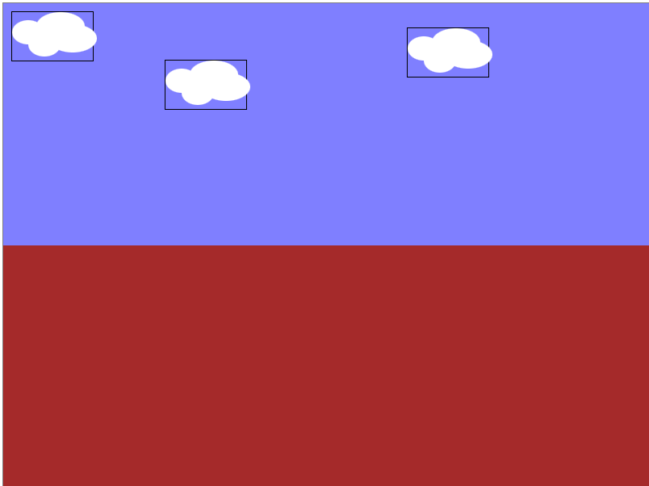

# Capítulo 3

## Dibujo de un marco estático

Introducción

En esta sesión, utilizaremos lo que aprendimos anteriormente para crear un marco estático.


Con tantos contenedores como sean necesarios, crearemos un paisaje que será el entorno en que se desarrollará el juego.

```html
    <body>
        <div class="frame"></div>
    </body>
```

Dentro de este marco, utilizaremos 2 porciones principales para describir el entorno. El cielo y el suelo

```html
<div id="frame">
    <div class="cielo"></div>
    <div class="suelo"></div>
</div>
```

Luego, dentro del cielo pondremos una nube, la cual estará compuesta por 4 cúmulos
```html
<div id="frame">
    <div class="cielo">
        <div class="nube" id="nube1">
                    <div class="cumulo1"></div>
                    <div class="cumulo2"></div>
                    <div class="cumulo3"></div>
                    <div class="cumulo4"></div>
                </div>
    </div>
    <div class="suelo"></div>
</div>
```

Nótese que la nube tiene una clase y un id. Mientras que la clase puede ser utilizada en otra nube, el id es único.

Ahora, escribiremos estilos para estas nubes y para los contenedores principales, el suelo y el cielo

```css
.cielo{
    width: 100%;
    height: 300px;
    background: rgba(0,0,255,0.5);
}
.suelo{
    width: 100%;
    height: 300px;
    background: brown;
}
.nube{
    border: 1px solid black;
    width: 100px;
    height: 60px;
}

.cumulo1{
    background: white;
    width: 40px;
    height: 30px;
    border-radius: 50%;
    position: absolute;
    top: 10px;
    
}

.cumulo2{
    background: white;
    width: 40px;
    height: 30px;
    border-radius: 50%;
    position: absolute;
    left: 20px;
    top: 25px;
}

.cumulo3{
    background: white;
    width: 60px;
    height: 35px;
    border-radius: 50%;
    position: absolute;
    left: 30px;
    top: 0px;
}

.cumulo4{
    background: white;
    width: 60px;
    height: 35px;
    border-radius: 50%;
    position: absolute;
    left: 45px;
    top: 15px;
}
```
Tanto el cielo, como el suelo, usan un 100% del ancho del contenedor, y una altura del 50%, equivalente a 300 px.

El atributo position: absolute, permite que los elementos hijos tomen una posición definida con respecto a su padre. De esta forma, los valores otorgados en left y top son respectivamente las distancias desde el borde izquierdo y superior. Al variar estos atributos, conseguimos cambiar la posicion de los distintos cúmulos dentro de la nube.

Hasta ahora, tendremos solo una nube en la porcion superior izquierda. Utilizaremos código css para generar 3 tipos de nubes, según su id

```css
#nube1{
    position: absolute;
    left: 10px;
    top: 10px;
}

#nube2{
    position: absolute;
    left: 200px;
    top: 70px;
}

#nube3{
    position: absolute;
    left: 500px;
    top: 30px;
}
```

Luego, declararemos estas nubes dentro del código HTML

```html
<div class="nube" id="nube1">
    <div class="cumulo1"></div>
    <div class="cumulo2"></div>
    <div class="cumulo3"></div>
    <div class="cumulo4"></div>
</div>
<div class="nube" id="nube2">
    <div class="cumulo1"></div>
    <div class="cumulo2"></div>
    <div class="cumulo3"></div>
    <div class="cumulo4"></div>
</div>
<div class="nube" id="nube3">
    <div class="cumulo1"></div>
    <div class="cumulo2"></div>
    <div class="cumulo3"></div>
    <div class="cumulo4"></div>
</div>
```
El marco con 3 nubes debe verse de la siguiente forma



Es ciertamente recomendable mantener los bordes de los objetos que se desea manipular en el futuro, ya que esto nos permite hacer más rapidamente los cálculos que modifican la posición de estos.

En el capítulo 5 veremos cómo generar movimientos periódicos en las nubes, utilizando animaciones de css.

Ahora que tenemos lo básico, comenzaremos por escribir cierto contenido dentro de las etiquetas head

```html
<head>
    <meta charset="utf-8">
    <title>Juego de Ejemplo</title>
</head>
```

La etiqueta meta nos permite declarar metadatos, que en este caso, nos permitirán usar caracteres especiales tales como ñ o letras con acentos.

Por su parte, las etiquetas title nos permiten darle un titulo al documento. Al abrir este html en un navegador, el titulo corresponde al texto que se oberva en la parte superior de la pestaña.

De aquí en adelante, solo trabajaremos en el interior de las etiquetas body, que corresponden al cuerpo del documento. Dentro de ellas, colocaremos todos los elementos que queremos que el usuario vea.

```html
<body>
    <h1>Aquí va el contenido principal</h1>
    <h2>Esto es un subtítulo</h2>
    <a href="www.google.cl">Esto es un link a google</a>
</body>
```

En este caso, hemos incorporado 3 elementos al cuerpo del documento. En primero lugar, tenemos una etiqueta h1. Estas se utilizan cuando se desea crear un título. Mientras más grande sea el número que acompaña a la h, más pequeña será la fuente del texto.

Luego, tenemos un enlace o hipervínculo, que nos permite saltar hacía otra web en un simple click. Este elemento es esencial, porque es parte de lo que define a una página web propiamente tal.

En la última versión de html, existen muchísimas etiquetas, sin embargo, con la finalidad de escribir juegos nos centraremos solo en unas pocas. La que más utilizaremos se llama div, y corresponde a un contenedor. Dicho de otra forma, es tan solo un área rectangular. Mediante el uso de algunos estilos, conseguiremos que este contenedor adquiera propiedades específicas tales como tamaños, formas, colores, bordes, animaciones, etc.

Dado que un contenedor div por si solo, no contiene información alguna, agregar estos elementos dentro del cuerpo del documento no generará ningún efecto.

Para poder visualizar los contenedores, tendremos que agregar estilos. Sin embargo, antes de descrubrir como hacer esto, necesitaremos otorgarles una clase a estos div

En HTML se utiliza la palabra reservada "class" para señalar la clase de un elemento. Esto se incluye dentro de la etiqueta de apertura, tal como se muestra en la siguiente porción de código

```html
<div class="clase1"></div>
<div class="clase2"></div>
<div class="clase2"></div>
```

Al asignar un estilo a una clase, todos los elementos que compartan la misma clase adoptarán el mismo aspecto.

Por otra parte, también existen identificadores, que se aplican a tan solo un elemento en todo el documento. Estos se aplican con la palabra "id"

```html
<div id="id1"></div>
<div id="id2"></div>
<div id="id3"></div>
```

Dicho esto, es importante notar lo siguiente. Cuando se desea reutilizar un elemento, se deben usar clases, mientras que al individualizar un elemento, se debe utilizar un id. Jamás se debe repetir un id.